# Folio

A local PDF reader for Android with a reading experience modelled on e-book readers: the page fills the
screen, controls stay hidden until you tap, and the app reopens every document where you stopped.

No store, no account, no ads, no analytics. Reading works offline. The network is used only by the
optional web search.

## Screenshots

Taken on a Samsung Galaxy A35 (Android 16) with the release build.

| Library | Reading | Controls |
|---|---|---|
| 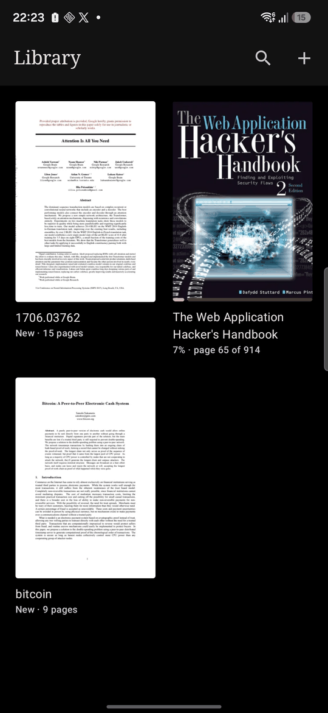 | 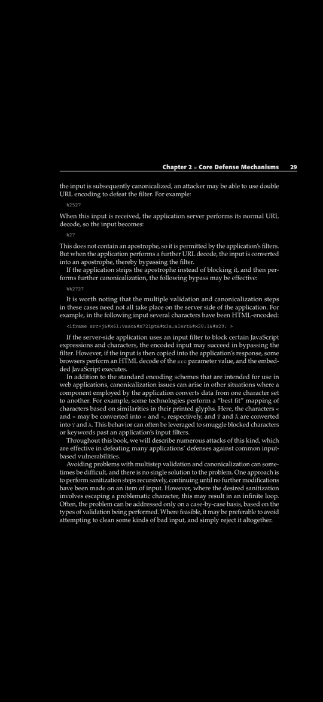 | 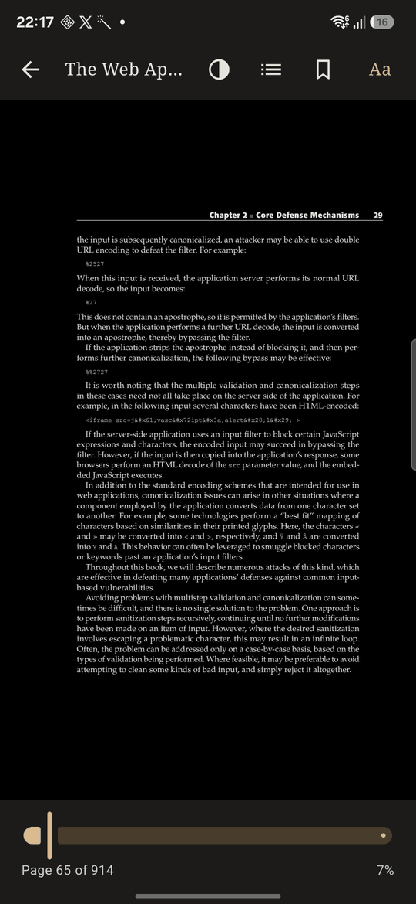 |

| Light | Sepia | Settings |
|---|---|---|
| 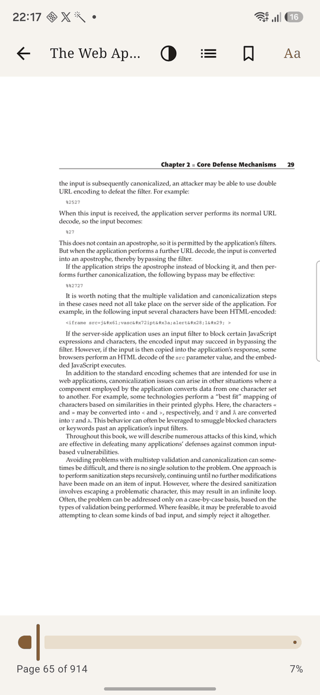 | 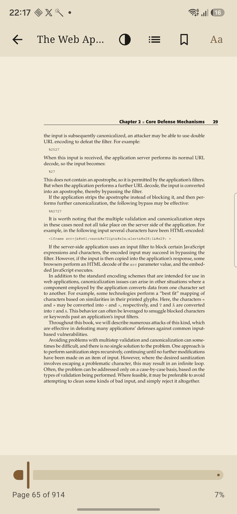 | 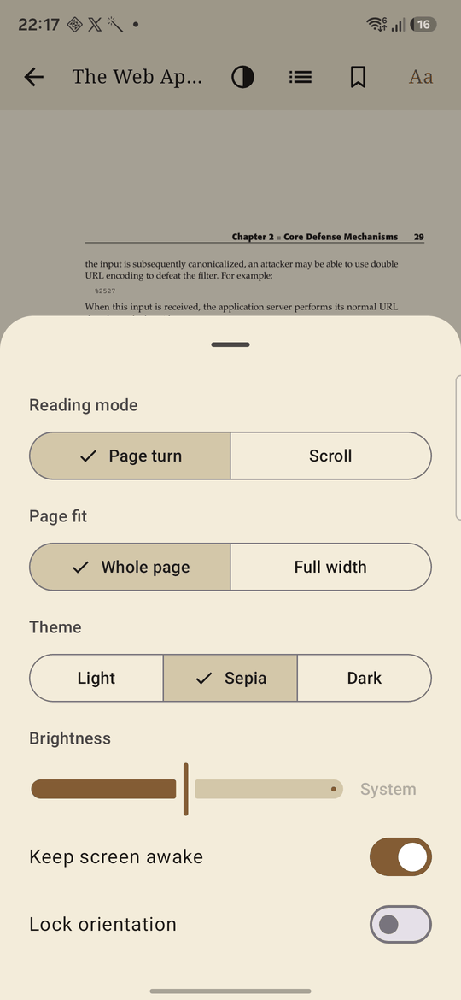 |

| Web search | Preview before adding | Search history |
|---|---|---|
| 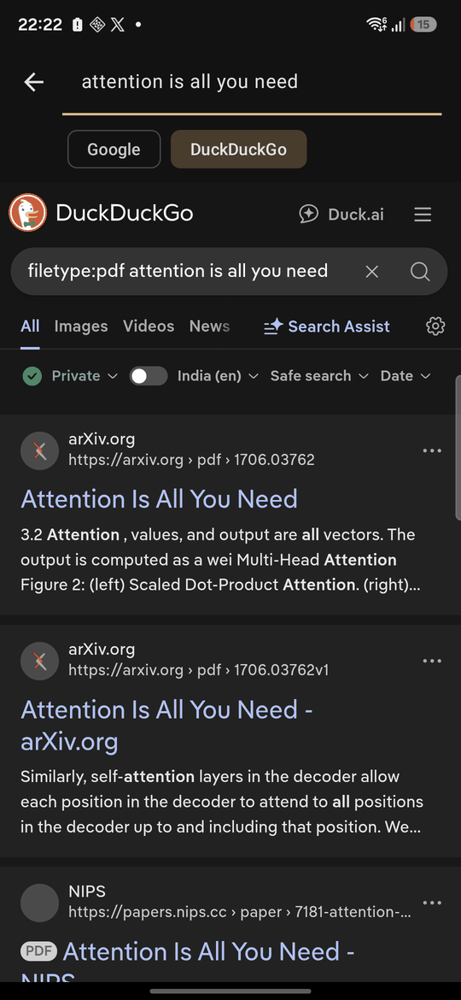 | 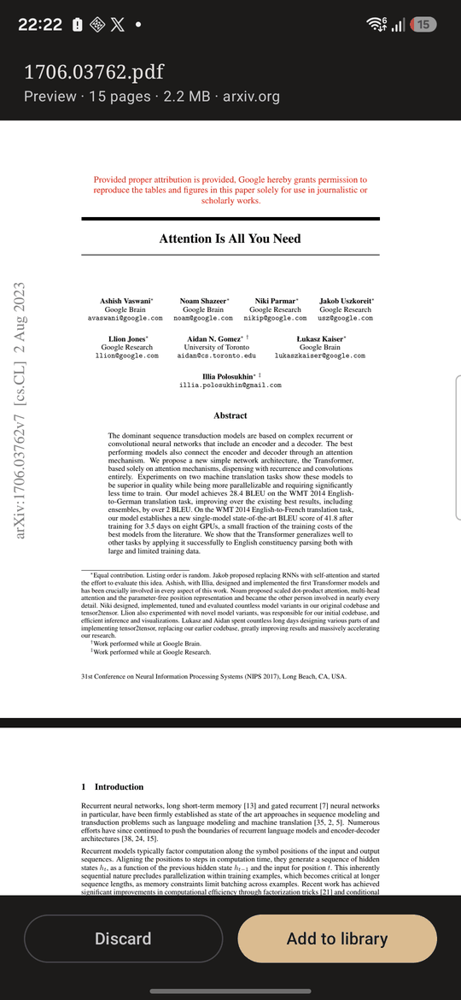 | 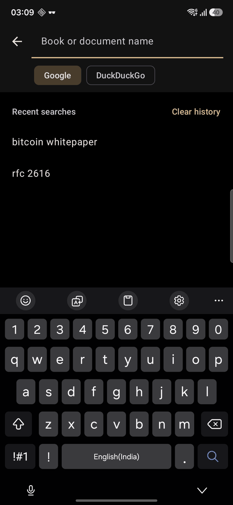 |

| Choose cover | Page actions | Crop |
|---|---|---|
| 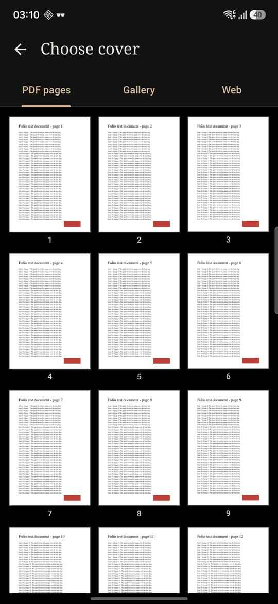 | 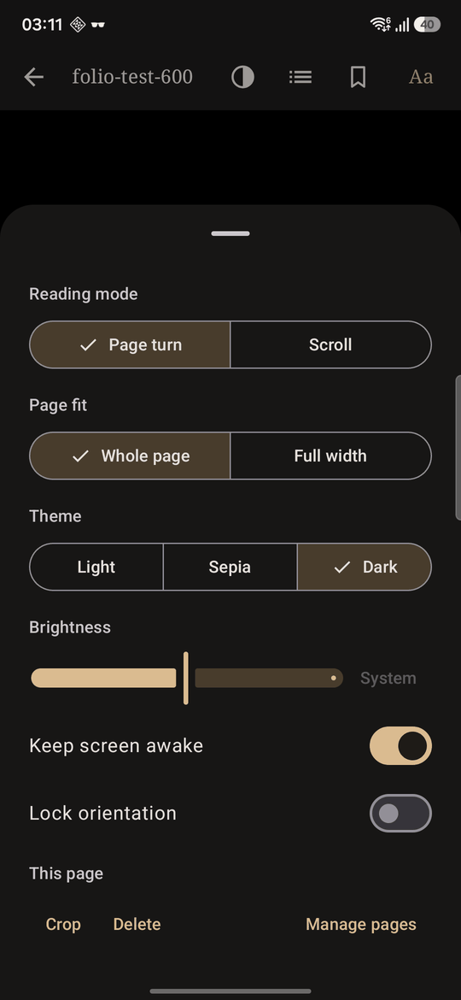 | 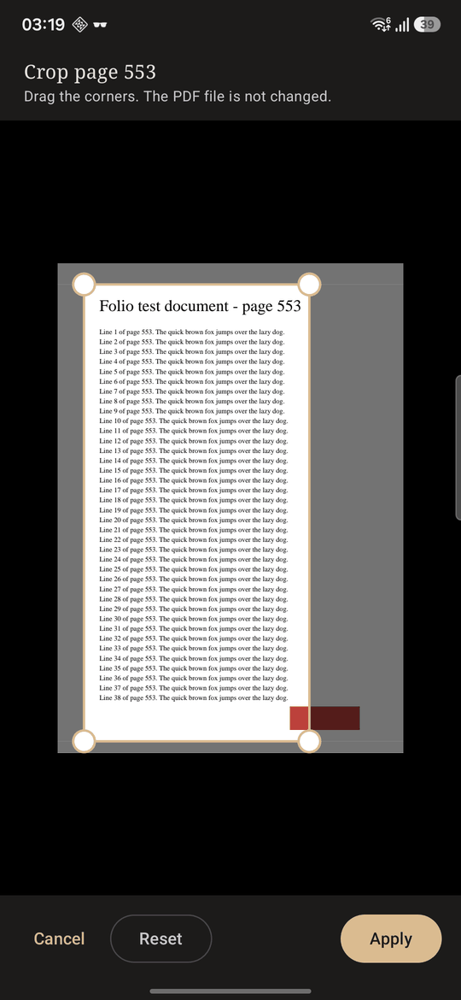 |

Update notice in the library:

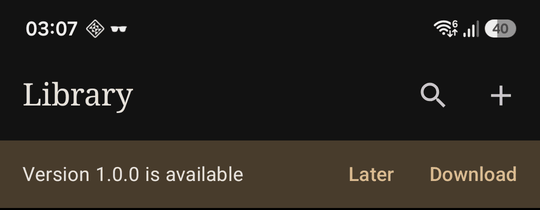

## Features

| Area | What works in v1 |
|---|---|
| Import | Android file picker, "Open with", Share Sheet |
| Web search | Searches Google and DuckDuckGo for `filetype:pdf <name>` and shows each file one time. Each result is a card with the first page, the page count and the size. More results load at the end of the list. A tapped card opens as a preview. It enters the library only after "Add to library". Keeps the last 20 searches, with **Clear history** |
| Library | Cover grid, progress, last-opened order, rename, remove |
| Covers | Long press a book, then **Change cover**: a page of the PDF, a photo from the phone, or an image from the web (long-press an image, or paste its link) |
| Delete pages | Removes pages from the reader's view, with Undo. **Manage pages** deletes and restores many pages |
| Crop pages | Draw the visible area of a page. Applies to one page or to all pages |
| Updates | The library shows a notice when a newer release is on GitHub. **Download** opens the release page |
| Reader | Full screen, tap centre to show or hide controls, tap edges to turn the page |
| Reading modes | Page turn (default) and vertical scroll |
| Page fit | Whole page or full width |
| Zoom | Pinch and double tap, up to 4x |
| Navigation | Page scrubber, page number, percent read |
| Position | Saved on every page turn. Survives app restart and device restart |
| Bookmarks | Toggle per page, bookmark list with jump |
| Themes | Light, sepia, dark. One-tap switch in the top bar. Starts dark when the phone is in dark mode |
| Comfort | Brightness (reader only), keep screen awake, orientation lock |
| Text mode | **Text** in the top bar reads the page with text recognition and shows it as text that fits the screen. Text size from 12 to 40. **PDF** in the top bar goes back to the original page. Each book remembers its mode. Works offline. Languages: Latin script, Hindi and Marathi, Chinese, Japanese, Korean |
| Word meaning | In text mode, long press a word, then **Meaning**. The meaning comes from Wiktionary and needs an internet connection |
| Highlights | In text mode, long press a word and drag to select more. Four colours, a note per highlight, **Copy**. Tap a highlight to change or delete it. The bookmark list also shows the highlights |

Not in the app: text search, table of contents, thumbnails, reading statistics, password-protected PDFs.

## Build and run

Requirements: Android Studio 2025.x or newer, Android SDK platform 36, a phone with Android 12 or newer.

### Android Studio

1. **File > Open**, select this folder.
2. Wait for Gradle sync.
3. On the phone: **Settings > Developer options > USB debugging**, then connect the USB cable.
4. Press **Run**.

### Command line (Windows)

```powershell
$env:JAVA_HOME = "C:\Program Files\Android\Android Studio\jbr"
.\gradlew.bat assembleDebug          # APK: app\build\outputs\apk\debug\app-debug.apk
.\gradlew.bat testDebugUnitTest      # unit tests
.\gradlew.bat connectedDebugAndroidTest   # database tests, needs a connected phone
adb install -r app\build\outputs\apk\debug\app-debug.apk
```

`local.properties` holds the SDK path (`sdk.dir`). Android Studio writes it on first open.

You can also copy `app-debug.apk` to the phone and open it there. Android asks for permission to install
from that source.

## Releases

`.github/workflows/ci.yml` runs unit tests, lint and a debug build on every push and pull request.
A tag that starts with `v` also builds the signed, minified APK and attaches it to a GitHub release.

```bash
git tag v1.0.0
git push origin v1.0.0
```

The workflow needs four repository secrets
(**Settings > Secrets and variables > Actions > New repository secret**):

| Secret | Value |
|---|---|
| `FOLIO_KEYSTORE_BASE64` | The release keystore, base64 encoded |
| `FOLIO_KEYSTORE_PASSWORD` | Keystore password |
| `FOLIO_KEY_ALIAS` | Key alias |
| `FOLIO_KEY_PASSWORD` | Key password |

Keep the keystore safe. Android installs an update only when it is signed with the same key.

To build a signed release on your own PC, set `FOLIO_KEYSTORE_FILE`, `FOLIO_KEYSTORE_PASSWORD`,
`FOLIO_KEY_ALIAS` and `FOLIO_KEY_PASSWORD`, then run `gradlew assembleRelease`.

## Architecture

Single activity, Jetpack Compose, MVVM. ViewModels expose `StateFlow`. No dependency injection framework:
`AppContainer` builds the three shared objects once.

```
app/src/main/java/com/shreyas/pdfreader/
  ReaderApp.kt            Application and AppContainer
  MainActivity.kt         Hosts Compose, receives "Open with" and Share intents
  navigation/AppNav.kt    library -> reader/{documentId}, library -> search
  data/
    db/                   Room: documents, bookmarks, page edits, page text, highlights
    LibraryRepository.kt  Import, remove, rename, progress, bookmarks, covers, page edits
    CoverWriter.kt        Loads images for covers, stores covers
    UpdateChecker.kt      Reads the newest release from GitHub
    Dictionary.kt         Word meanings from Wiktionary
    SettingsStore.kt      DataStore: reader settings
    PdfDownloader.kt      Downloads a PDF from the web into the cache
  pdf/
    PdfDocumentRenderer.kt  Wraps android.graphics.pdf.PdfRenderer
    PageBitmapCache.kt      LRU cache bounded by bytes
    PageSource.kt           One open PDF with its cache, shared by all screens
    PageEdits.kt            Deleted pages and crops, crop box maths
    PageOcr.kt              Text recognition with ML Kit, text assembly, highlight places
  ui/
    library/              Library screen, card, ViewModel
    reader/               Reader screen, pages, zoom, bars, sheets, ViewModel
    search/               Web search, PDF preview, ViewModel
    cover/                Cover selection
    pages/                Page manager
    components/           Icons drawn for this app, page grid
    theme/                App theme, reader theme, page filters
  util/Progress.kt
```

### Decisions

- **Kotlin and Compose, not Flutter.** Rendering, storage access, brightness and full-screen mode are
  platform APIs. Flutter needs a plugin for each.
- **Framework `PdfRenderer`.** No native library in the APK, no licence limits, reads `content://` files
  without a copy. The alternatives were rejected: `androidx.pdf` is beta and has no page-turn mode,
  AndroidPdfViewer is abandoned, MuPDF is AGPL and large, pdf.js in a WebView is slow.
- **Files are not copied** when they come from the file picker. The app keeps a persistent read grant.
  Files from "Open with" and the Share Sheet are copied into app storage, because Android ends that
  grant when the activity closes.
- **Progress is stored on the document row**, written on every page turn.
- **Delete and crop do not change the PDF file.** The framework renderer cannot write PDF files, and
  files from the file picker are read-only for the app. Folio stores the edits in its database and
  applies them when it draws a page. Every edit can be undone. A cropped area is rendered at full
  sharpness, not enlarged from a picture of the whole page.
- **Text mode uses ML Kit text recognition with the models inside the APK.** No Google Play services
  and no network are needed, and no page leaves the phone. The cost is a larger APK. The text of a
  page is recognized once and stored in the database. The PDF file is not changed.
- **A highlight stores its text, not only its place.** When a page is recognized again after a crop,
  the highlight is found again by its text.
- **Word meaning sends the selected word to Wiktionary**, and nothing else.
- **The update check reads one public GitHub address**, at most once per day. It sends no data about
  the phone or the library.
- **Web search reads the result pages of the search engines.** The engines give results only to a
  browser, so a WebView that is not on the screen loads each page. The page gets no access to files
  or to app code. When one engine fails, the results of the other engine show.
- **A result card reads only parts of the file.** A PDF has its table of contents at the end, so the
  start of the file is not enough. The app asks the server for the parts that the first page needs
  (HTTP `Range`), through `StorageManager.openProxyFileDescriptor`. In the test that was 0.2 MB to
  1.6 MB of files of 1 MB to 11 MB. The whole file downloads only after a tap on the card.
  A server that cannot give parts gives the whole file, up to 25 MB.
- **Files of previews stay in the cache**, at most 300 MB, until the next search or until the search
  screen closes.

### Memory

- Only the visible page and its neighbours are rendered.
- All PDF access runs on one thread. `PdfRenderer` allows one open page at a time.
- A rendered page is capped at 8 million pixels (page mode) or 4 million pixels (scroll mode).
- The cache holds a quarter of the app memory class, between 32 MB and 128 MB.

## Known limitations

- **Dark and sepia are filters, not recolouring.** A PDF stores fixed colours. Dark mode inverts the whole
  page, so photos and diagrams are inverted too. Sepia tints the page.
- **Very high zoom is slightly soft.** A zoomed page is rendered again as one bitmap up to the pixel cap.
  On a 1080 px wide phone that is sharp to about 2.2x in page mode and 1.5x in scroll mode.
- **A tap waits about 0.3 s** before the controls appear. Android needs that time to rule out a double tap.
- **Password-protected PDFs** do not open.
- **A moved or deleted file** shows "File not available" in the library. Remove it and import it again.
- **Pages of mixed sizes** shift a little in scroll mode the first time they appear.
- **Deleted and cropped pages exist only in Folio.** Another app that opens the same PDF shows the
  whole file. A book that is removed from the library loses its page edits.
- **Updates are not installed by the app.** The notice opens the release page. Download and install
  the APK from there.
- **Text mode is only as good as the text recognition.** Small or unclear print gives wrong letters.
  Pages with columns or tables can come out in the wrong order. Pictures do not show in text mode.
  A page without text shows as the original page. Use **PDF** in the top bar when the text is wrong.
- **Text mode always turns pages**, also when the reading mode is Scroll.
- **Selection and highlights work only in text mode.** The original pages have no selection, search or links.
- **Meanings are in English** and need an internet connection.
- **Google can ask for a CAPTCHA** in the web search. The results then come from DuckDuckGo only.
- **Web search uses mobile data** for the first page of each result, about 0.5 MB each. The search engines can change
  their pages, and the search then finds nothing until the app is updated.
- **Web search finds only PDFs that are public on the web.** Sites that need a login do not work.
  You are responsible for the right to download a file.

## Future improvements

1. Text search and exact text for PDFs with a text layer, with the Android 15 `PdfRenderer` text APIs
   (`PdfRendererPreV` on Android 12 to 14). Text recognition is then needed only for scanned pages.
2. Table of contents with `io.legere:pdfiumandroid` (Apache-2.0).
3. Tile rendering for sharp zoom at any level.
4. Thumbnail strip in the scrubber.
5. Password prompt for protected PDFs.

## Test status

- Unit tests: progress, zoom maths, download file names, version comparison, search history,
  page mapping, crop box maths, text assembly, highlight places, dictionary answers.
- Instrumented tests: database queries. They need a phone or emulator.
- Manual test on a Samsung Galaxy A35, Android 16, release build: import, 600-page and 914-page PDFs,
  page turn, scroll mode, zoom, scrubber, bookmarks, themes, position after force stop, web search,
  preview, add and discard.
- Text mode, manual test on the same phone, release build installed over v1.1.0: text recognition in
  English and Hindi, page without text, text size, word meaning, highlights, notes, highlight list,
  switch between text and PDF, state after restart of the app.

APK size: about 50 MB for the release build, about 82 MB for the debug build. The text recognition
models for five scripts and four processor types are most of it.
